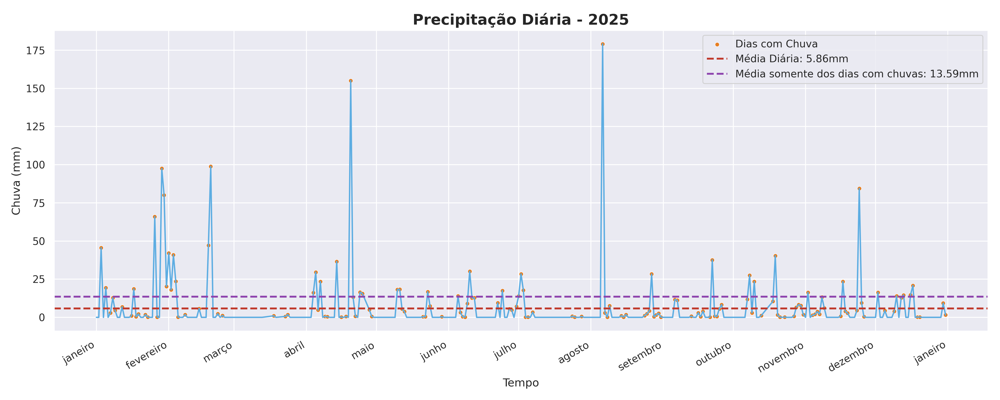
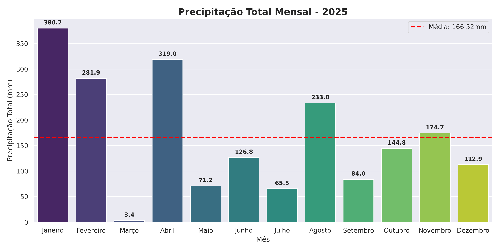
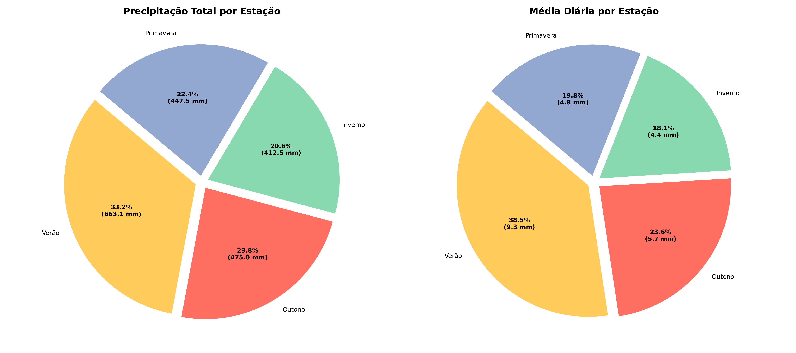

# **Análise de Precipitação Pluviométrica – 2025**

Este projeto realiza uma análise exploratória de dados (EDA) sobre a precipitação diária (em mm) de uma cidade ao longo do ano de 2025, utilizando Python. O foco está em tratamento de dados, agregações temporais e visualização, com geração de gráficos claros e estatísticas relevantes.

### Estrutura do Projeto
```
├── dados-precipitacao.csv        # Dataset bruto
├── dados.py                      # Carga, limpeza e análises principais
├── grafico_chuva_diaria.py       # Gráfico de precipitação diária
├── grafico_chuva_mensal.py       # Gráfico de precipitação mensal
├── grafico_chuva_estacacoes.py   # Gráficos por estação do ano
├── graficos/                     # Gráficos gerados automaticamente
└── README.md
```

### Dataset
- Período: Janeiro a Dezembro de 2025
- Granularidade: diária
- Unidade: milímetros (mm)

Colunas utilizadas

- `Data`: data da medição
- `Valor`: volume de chuva em mm

Colunas irrelevantes e metadados são removidos durante o pré-processamento.

### Processamento dos Dados (dados.py)

O módulo dados.py é responsável por:

- Leitura do arquivo CSV
- Limpeza e padronização dos dados
- Conversão de tipos (datas e valores numéricos)
- Verificação de dados ausentes e duplicados
- Cálculo de métricas como:
    - Chuva acumulada anual
    - Média diária de precipitação
    - Média considerando apenas dias com chuva
    - Dias com e sem precipitação
    - Acumulado semanal, mensal e por estação
    - Dias com maior e menor volume de chuva

Também disponibiliza a função reutilizável:
`carregar_dados()
Essa função é utilizada em todos os scripts de visualização.

### Visualizações Geradas

Todos os gráficos são salvos automaticamente na pasta `graficos/`.

##### 1. Precipitação Diária
Script: `grafico_chuva_diaria.py`
- Série temporal diária ao longo do ano
- Destaque visual para dias com chuva
- Linhas de referência para:
    - Média diária geral
    - Média apenas dos dias chuvosos
- Eixo temporal organizado por meses

Arquivo gerado: `precipitacao_diaria.png`

##### 2. Precipitação Mensal
Script: `grafico_chuva_mensal.py`
- Gráfico de barras com o acumulado mensal
- Linha de referência com a média mensal
- Valores anotados diretamente nas barras
- Meses formatados conforme o locale pt-BR

Arquivo gerado: `media_mensal.png`

##### 3. Precipitação por Estação do Ano
Script: `grafico_chuva_estacacoes.py
- Dois gráficos de pizza:
    - Total acumulado por estação
    - Média diária por estação
- Estações consideradas:
    - Verão
    - Outono
    - Inverno
    - Primavera

Arquivo gerado: `pizza_estacoes.png`

## Conclusões a partir dos Gráficos
##### 1. Comportamento Diário da Chuva

A análise da precipitação diária mostra uma alta variabilidade ao longo do ano, com muitos dias sem chuva intercalados por eventos concentrados.
A média considerando apenas os dias chuvosos é significativamente maior que a média geral, indicando que a precipitação ocorre de forma pontual e intensa, e não distribuída uniformemente.


##### 2. Distribuição Mensal da Precipitação

O gráfico mensal evidencia uma desigualdade clara entre os meses, com alguns concentrando grande parte do volume anual.
Meses acima da média mensal contribuem de forma desproporcional para o total do ano, o que reforça a importância de análises agregadas para planejamento hídrico e urbano.


### 3. Influência das Estações do Ano

A análise por estação mostra que determinadas estações concentram tanto o maior volume total quanto as maiores médias diárias de chuva.
Isso indica um padrão sazonal bem definido, essencial para estudos climáticos, agricultura, gestão de recursos hídricos e prevenção de eventos extremos.


Tecnologias Utilizadas
- Python 3
- pandas
- matplotlib
- seaborn
- calendar e locale

### Como Executar
1. Instalar dependências:
`pip install pandas matplotlib seaborn`
2. Executar os scripts:
`
python grafico_chuva_diaria.py
python grafico_chuva_mensal.py
python grafico_chuva_estacacoes.py
`
Os gráficos serão salvos automaticamente.

Objetivo do Projeto
- Praticar conceitos de **ETL e análise exploratória**
- Trabalhar com **séries temporais**
- Produzir **visualizações interpretáveis**
- Criar um projeto sólido para **portfólio de dados**
